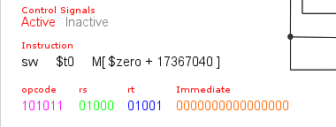
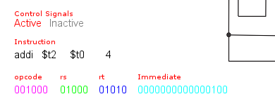
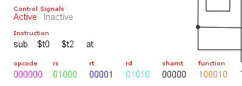
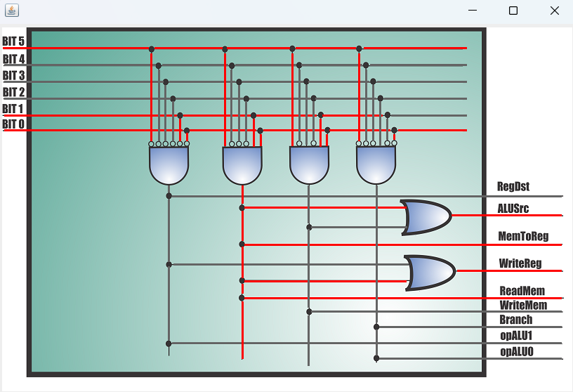
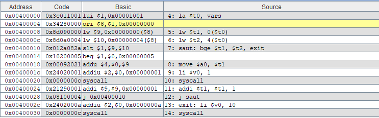
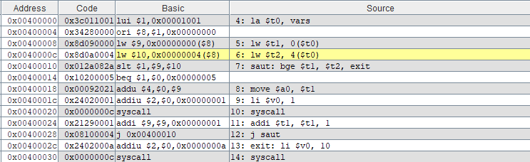
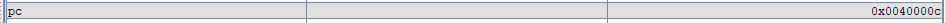
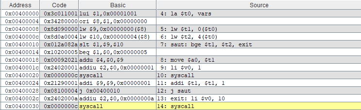

# TP1 HOMEWORK
## Exercise 01 :
### question 1 :
the binary code of each instruction and its format group.
#### instruction li $t0, 10
1. type is : immediate format.

   
  

#### instruction li $t1, 15
2. type is : immediate format.

   

#### instruction la $t2, vars  
3. type is : immediate format.

   
  

4. type is : immediate format.
  
  

#### instruction sw $t1, 0($t0)
5. type is : immediate format.

  

#### instruction lw $t2, 4($t0)
6. type is : immediate format.

  

#### instruction addi $t2, $t0,4
7. type is : immediate format.

  

#### instruction subi $t2, $t0,4
8. type is :  immediate format.

  

9. type is : register format.

  

#### instruction syscall
10. type is : register format.

  

### question 2:
the state of the control unit signals and the ALU control.
#### instruction sw $t1, 0($t0)
1. control unit signals :
   
   
   
3. ALU control signals :

   
   
#### instruction lw $t2, 4($t0)
1. control unit signals :
   
   
   
3. ALU control signals :
   
   
   
#### instruction addi $t2, $t0,4
1. control unit signals :
   
   
   
3. ALU control signals :
   
   
   

## Exercise 02 :
### question 1 :
the value of the PC register for each instruction.
1. first : 

  
  

2.second :

  
  

3.third :  

  
 

4. fourth :

  
 

5. fifth :

  
 

6. sixth :

  
 

7. seventh :

  
 

8. eighth :

  
  

## Exercise 03 :
### question 1 :
