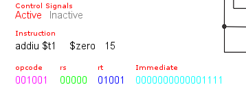
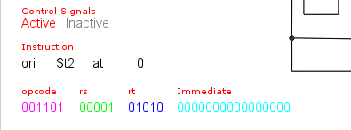
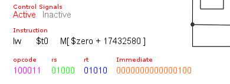
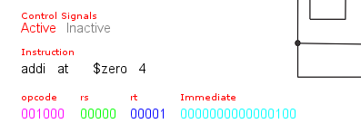
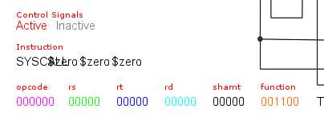
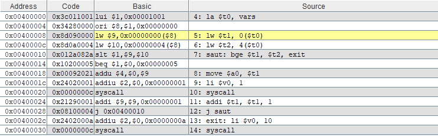
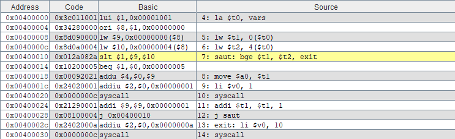
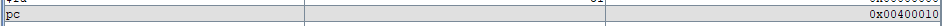
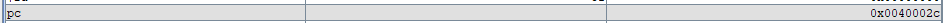

# TP1 HOMEWORK
## Exercise 01:
### question 1:
the binary code of each instruction and its format group.
1. type is :

   
  

2. type is :

   

   
6. type is :

   
  

4. type is :
  
  

7. type is :  

  

6. type is :  

  

7. type is :

  

9. type is :  

  

9. type is :

  

11. type is :  

  

### question 2:
the state of the control unit signals and the ALU control.
#### instruction sw $t1, 0($t0)
1. control unit signals :
   
   
   
3. ALU control signals
#### instruction lw $t2, 4($t0)
1. control unit signals :
   
   
   
3. ALU control signals
#### instruction addi $t2, $t0,4
1. control unit signals :
   
   
   
3. ALU control signals

## Exercise 02:
the value of the PC register for each instruction.
1. first :

  
  

2.second :  

  
  

3.third :  

  
 

4. fourth :

  
 

5. fifth :

  
 

6. sixth :

  
 

7. seventh :

  
 

8. eighth :

  
 
