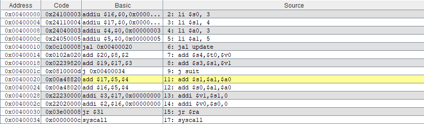
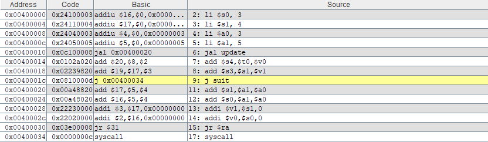

# TP1 HOMEWORK
## Exercise 01 :
```asm
.data
vars:   .word 5
     .text
li $t0, 10
li $t1, 15
la $t2, vars
sw $t1, 0($t0)
lw $t2, 4($t0)
addi $t2, $t0,4
subi $t2, $t0,4
syscall
```
### question 1 :
the binary code of each instruction and its format group.
#### instruction li $t0, 10
1. type is : immediate format.

   
  

#### instruction li $t1, 15
2. type is : immediate format.

   


#### instruction la $t2, vars  
3. type is : immediate format.

   
  

4. type is : immediate format.
  
  

#### instruction sw $t1, 0($t0)
5. type is : immediate format.


  

#### instruction lw $t2, 4($t0)
6. type is : immediate format.


  

#### instruction addi $t2, $t0,4
7. type is : immediate format.

  

#### instruction subi $t2, $t0,4
8. type is :  immediate format.


  

9. type is : register format.

  

#### instruction syscall
10. type is : register format.

  

### question 2:
the state of the control unit signals and the ALU control.
#### instruction sw $t1, 0($t0)
1. control unit signals :
   
   
   
3. ALU control signals :

   
   
#### instruction lw $t2, 4($t0)
1. control unit signals :
   
   
   
3. ALU control signals :
   
   
   
#### instruction addi $t2, $t0,4
1. control unit signals :
   
   
   
3. ALU control signals :
   
   
   

## Exercise 02 :
```asm
.data
vars: .word 5
.text
la $t0, vars
lw $t1, 0($t0)
lw $t2, 4($t0)
saut: bge $t1, $t2, exit
move $a0, $t1
li $v0, 1
syscall
addi $t1, $t1, 1
j saut
exit: li $v0, 10
syscall

```
### question 1 :
the value of the PC register for each instruction.
1. first : 

  
  

2.second :

  
  

3.third :  

  
 

4. fourth :

  
 

5. fifth :

  
 

6. sixth :

  
 

7. seventh :


  
 

8. eighth :


  
  

## Exercise 03 :
```asm
.text
li $s0, 3
li $s1, 4
li $a0, 3
li $a1, 5
jal update
add $s4,$t0,$v0
add $s3,$s1,$v1
j suit
update:
add $s1,$a1,$a0
add $s0,$a1,$a0
addi $v1,$s1,0
addi $v0,$s0,0
jr $ra
suit:
syscall

```
### question 1 :
the value of the PC register for the branch instructions.  
 
 1.first :  
 
   
   
 
 2.second :  
 
   
    
 
 3.third :  
 
   
  
 
 4.fourth :  
 
   
  
 
 5.fifth :  before jumping .
 
   
  
 
 6.sixth:  after jumping.
 
   
  
 
 7.seventh :  
 
   
  
 
 8.eighth :  
 
   
  
 
 9.nineth :  
 
   
  
 
 10.tenth :  before jumping.
 
   
  
 
 11.eleventh :  after jumping.
 
   
  
 
 12.twelfth :  
 
   
  
 
 13.thirteenth :  before jumping.
 
   
  
 
 14.fourteenth :  after jumping.
 
   
   
 
 ### question 2 :
 the problem in the given code is :
 > Overwriting $s1 and $s0 inside update function .
 
 ### question 3 :  
 two solutions for this problem :  
 > the use of temperory registers inside the update function instead of s0 and s1.

 ```asm
 update:
     add $t0, $a1, $a0    # $t0 = a1 + a0
     add $t1, $a1, $a0    # $t1 = a1 + a0 (if you need it again)
     addi $v1, $t0, 0     # move to $v1
     addi $v0, $t1, 0     # move to $v0
     jr $ra
 ```
 
 > save the value of s0 and s1 registers in a stack.

 ```asm
    update:
     addi $sp, $sp, -8      # Make space on stack
     sw $s0, 0($sp)         # Save $s0
     sw $s1, 4($sp)         # Save $s1
 
     add $s1, $a1, $a0      # Modify $s1
     add $s0, $a1, $a0      # Modify $s0
     addi $v1, $s1, 0
     addi $v0, $s0, 0
 
     lw $s0, 0($sp)         # Restore $s0
     lw $s1, 4($sp)         # Restore $s1
     addi $sp, $sp, 8       # Reclaim stack space
     jr $ra
 ``` 
